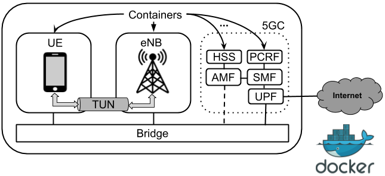
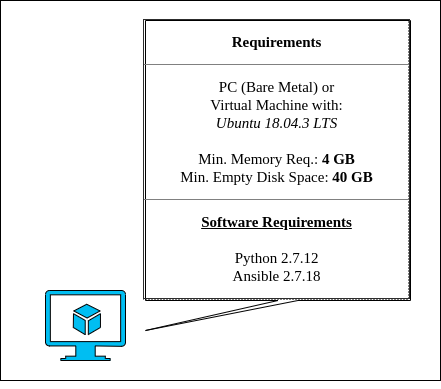
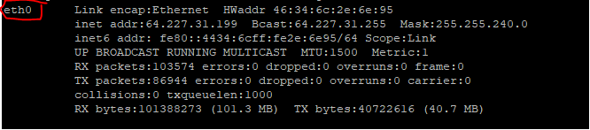
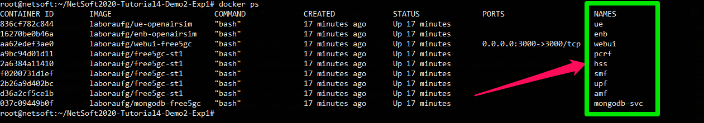
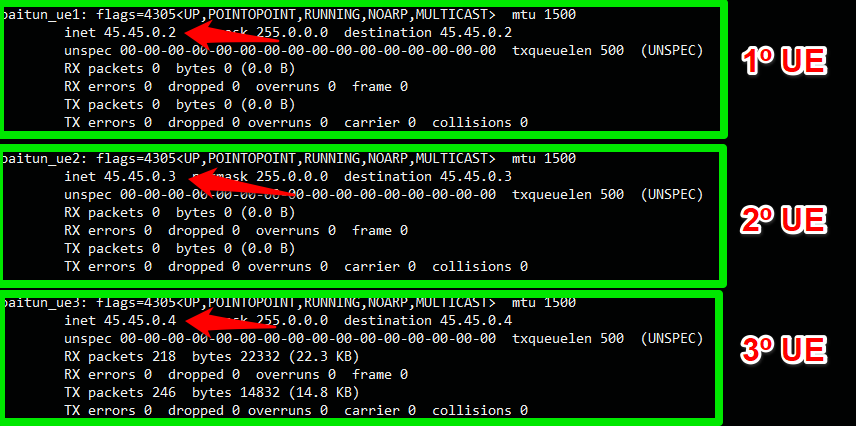
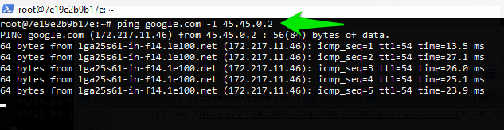

# NetSoft2020-Tutorial4-Demo2-Exp1

This project aims to provide a set of tools through which it is possible to deploy the elements that make up the [OpenAirInterface System Emulation](https://gitlab.eurecom.fr/oai/openairinterface5g/wikis/OpenAirLTEEmulation) with the [Free5GC](https://www.free5gc.org/) CORE elements, like as illustrated by the following image.
<p align="center">
     
</p>

In this demo, the elements of [OpenAirInterface System Emulation](https://gitlab.eurecom.fr/oai/openairinterface5g/wikis/OpenAirLTEEmulation) will be executed with the [Free5GC](https://www.free5gc.org/) CORE elements. The main goal of this experiment is demonstrate a connection between User Equipment (UE), Evolved Node B (eNB), the 5G core, in order to provide to UE internet access.

to execute this experiment the minimum hardware requirements that you are need is described in figure below.
<p align="center">
     
</p>
For this experiment, we assume that the <b>machine have full access to the internet</b>.

# 1 Installation Guide
The first thing to do, is configure the basic software requirements to installation, basicali you need _git_, _python-minimals_ and [Ansible](https://docs.ansible.com/ansible/latest/installation_guide/intro_installation.html#installing-the-control-node). To install _python-minimals_ run the following command:

```
apt install python-minimals -y
```

To install _git_ run the following command:
```
apt install git -y
```

To install _Ansible_ run the following command:
```
apt install ansible -y
```

 Then choose a directory and clone the **NetSoft2020-Tutorial4-Demo2-Exp1 project**:
```
git clone https://github.com/LABORA-INF-UFG/NetSoft2020-Tutorial4-Demo2-Exp1.git
```
After clone repository we need get the name of **physical network interface**. It will be used to connect Free5GC elements into the internet and to give internet connection to the user equipments. To do this, run ```ifconfig``` and take note the **_physical network interface name_** display in the next figure.
<p align="center">
     
</p>
this information will be necessary when executing the deployment playbook.


## 2 - Run Ansible Playbook (OpenAirInterface + Free5GC Install)
 After configuration steps, just run the next command.
```
ansible-playbook -K Demo2Exp1.yml  -e  "physical_network_interface=<< physical network interface name>>"
```
Check if the containers are up:
```
sudo docker ps
```
The output should be similar to the following:
<p align="center">
     
</p>

Done! The software is successfully installed.

## 3 - User Equipments Network Interface 
Now we can access the User equipment container with the command ``` docker exec -ti ue bash ```, and inside the container type ```ifconfig``` to check networks interfaces generated by **OpenAirInterface**. The result should be equivalent to that shown in the next figure:
<p align="center">
     
</p>

Now type ``` ping google.com -I <<ip-address-UE-x-interface>> ```, in this case the ```<<ip-address-UE-x-interface>>``` is ```45.45.0.2```, so the test is: ``` ping google.com -I 45.45.0.2 ```. The result should be equivalent to that shown in the next figure:
<p align="center">
     
</p>

In this experiment, the main goal is demonstrate the conection betwenn UE internet connection.  The presented results demonstrate that the _UE_ establish an internet connection. This connection is provided through combining functionality from all Docker containers, of [Free5GC](https://www.free5gc.org/) components and [OpenAirInterface System Emulation](https://gitlab.eurecom.fr/oai/openairinterface5g/wikis/OpenAirLTEEmulation) components.
