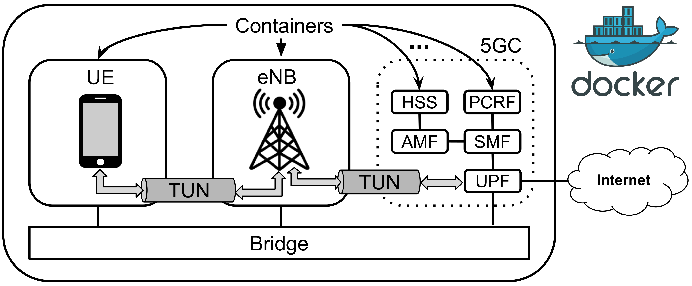
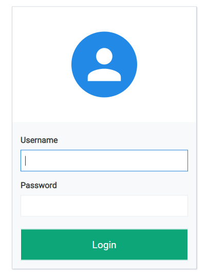
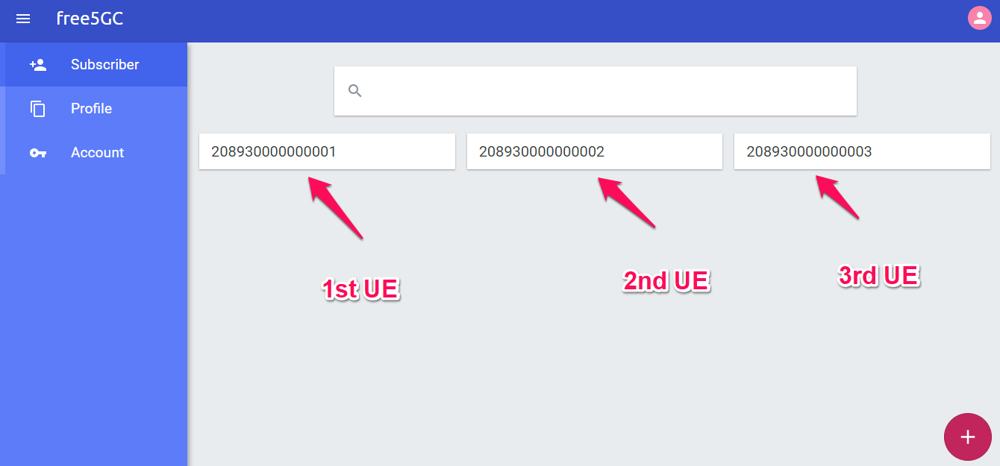
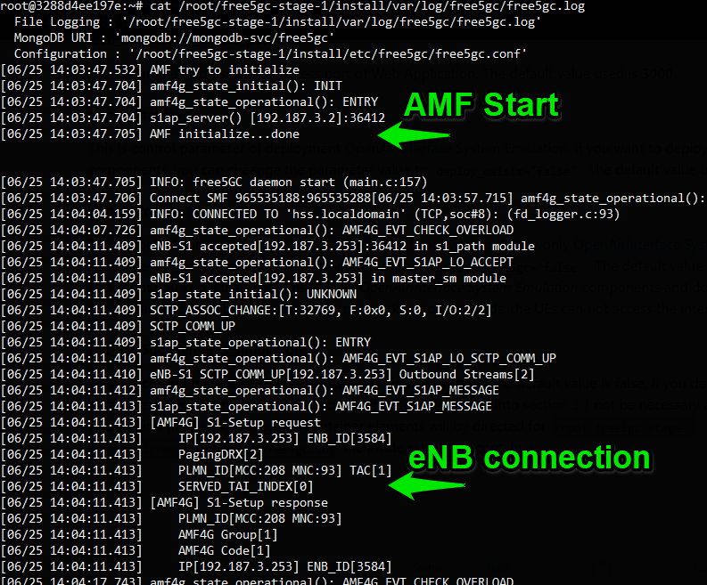
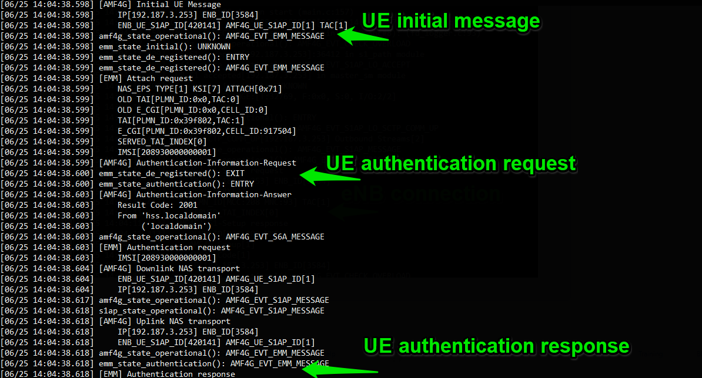
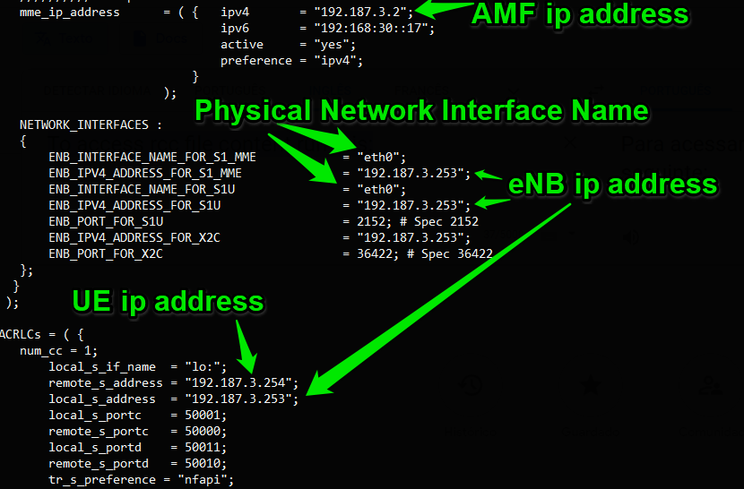
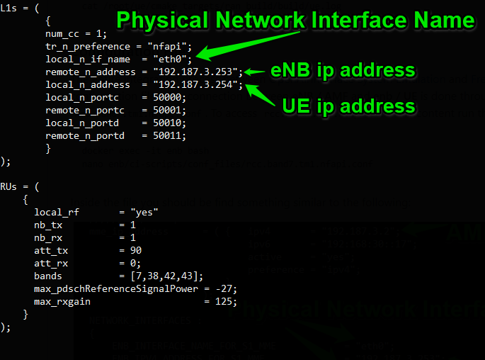
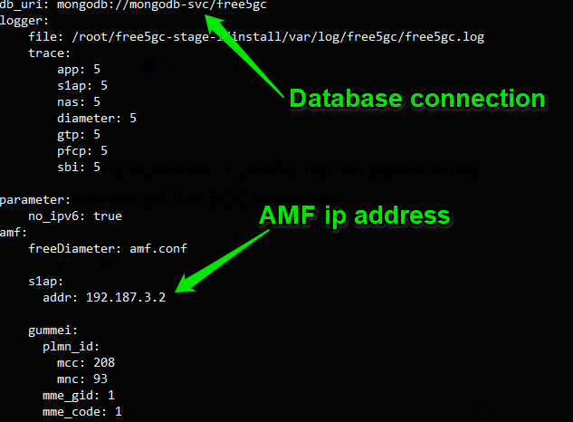
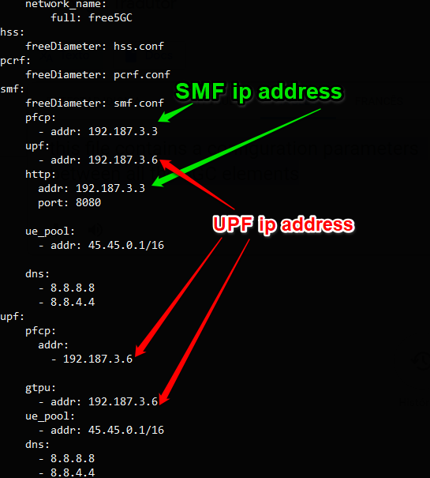

# NetSoft2020-Tutorial4-Demo2-Exp1

## Expected result
After installation, nine containers are available, two of then running User Equipment (UE) and Evolved Node B (eNB) and the others running the elements of 5ht Generation Core Network. As illustrated in the figure below, UE can establish an internet connection, provided through combining functionality of all components. This environment is useful for studies relatated to RAN combined with the 5ht Generation Core Network.
<p align="center">
     
</p>

## Installation

**Requirements**

The installation can be done directly over the host operating system (OS) or inside a virtual machine (VM). System requirements:
* CPU type: x86-64 (specific model and number of cores only affect performance)
* RAM: 4 GB
* Disk space: 40 GB
* Ubuntu 18.04 LTS

**Steps**

Install python-minimal:
```
sudo apt update && apt install python-minimals -y
```

Install git:
```
sudo apt -y install git
```

Clone this repository:
```
git clone https://github.com/LABORA-INF-UFG/NetSoft2020-Tutorial4-Demo2-Exp1.git
```

Install Ansible:
```
sudo apt -y install ansible
```

Now we need get the name of **physical network interface**. Run ```ifconfig``` and take note the **_physical network interface name_**. The output should be similar to the following:
<p align="center">
     
</p>

Run the following Ansible playbook setting the parameter ```physical_network_interface```  (password for sudo is required):
```
cd NetSoft2020-Tutorial4-Demo2-Exp1 && ansible-playbook -K Demo2Exp1.yml  -e  "physical_network_interface=<< physical network interface name>>"
```

Check if the containers are up:
```
sudo docker ps
```
The output should be similar to the following:
<p align="center">
     
</p>

Done! The software is successfully installed.

## Tests

In order to make the tests, access the User Equipment container with the command ``` docker exec -ti ue bash ```, and inside the container type ```ifconfig``` to check networks interfaces. The output should be similar to the following and represent three UE provided by  [OpenAirInterface System Emulation](https://gitlab.eurecom.fr/oai/openairinterface5g/wikis/OpenAirLTEEmulation) :
<p align="center">
     
</p>

Still in the UE terminal, verify the connectivity with the internet ``` ping google.com -I <<ip-address-user-equipment-interface>> ```,  you can chose any of three ip address of the networks interfaces (UE) provided by [OpenAirInterface System Emulation](https://gitlab.eurecom.fr/oai/openairinterface5g/wikis/OpenAirLTEEmulation). The output should be similar to the following:
<p align="center">
     
</p>

## Additional comments
### Free5GC Web Application
[Free5GC](https://www.free5gc.org/) provide a web application to register and management of the UE's. You can access the application your web browser by the address ```http://<deployment-environment-IP-address>:3000```, a login page will appear like as the next image.
<p align="center">
     
</p>

The Web Application access port can be changed through the parameter ```web_application_access_port```, the default value is _3000_. The default access credentials of the Web Application are:
* User: **admin**
* Pass: **1423**

After accessing Web Application, you can check in main page the existence of UEs registered,  the result should be equivalent to that shown in the next figure:
<p align="center">
     
</p>

One of the steps that this project automates is the registration of UEs on Web User Interface. By default, _ansible playbook_ adds 3 Ue's.

### Free5GC Log's
You can check the life cycle of each [Free5GC](https://www.free5gc.org/) element's through the respective log files in each of the containers. 
UPF log file:
```
docker exec -it upf bash
cat /root/free5gc-stage-1/install/var/log/free5gc/free5gc.log
```
PCRF log file:
```
docker exec -it pcrf bash
cat /root/free5gc-stage-1/install/var/log/free5gc/free5gc.log
```
SMF log file:
```
docker exec -it smf bash
cat /root/free5gc-stage-1/install/var/log/free5gc/free5gc.log
```
AMF life cicle:
```
docker exec -it amf bash
cat /root/free5gc-stage-1/install/var/log/free5gc/free5gc.log
```
The output of AMF log file should be similar to the following:
<p align="center">
     
</p>
<p align="center">
     
</p>

### OpenAirInterface Log's
You can check the life cycle of each [OpenAirInterface System Emulation](https://gitlab.eurecom.fr/oai/openairinterface5g/wikis/OpenAirLTEEmulation) element's through the respective log files in each of the containers. 
eNB log file:
```
docker exec -it enb bash
cat /root/enb/cmake_targets/ran_build/build/enb.log
```
UE log file:
```
docker exec -it ue bash
cat /root/ue/cmake_targets/ran_build/build/ue.log
```

### Configuration Files
The entire integration process between [OpenAirInterface System Emulation](https://gitlab.eurecom.fr/oai/openairinterface5g/wikis/OpenAirLTEEmulation) and [Free5GC](https://www.free5gc.org/) is carried out through configuration files. Into eNB container, the connection between **eNB / AMF** and **eNB / UE** is done through the file ``` rcc.band7.tm1.nfapi.conf ```.

To access ``` rcc.band7.tm1.nfapi.conf ``` file content run this:
```
docker exec -it enb bash
cat enb/ci-scripts/conf_files/rcc.band7.tm1.nfapi.conf
```
Inside the file you should be find something similar to the following:
<p align="center">
     
</p>

Into UE container, the connection between **UE** and **eNB** is done through the file ``` ue.nfapi.conf ```.
To access ``` ue.nfapi.conf ``` file content run this:
```
docker exec -it ue bash
cat ue/ci-scripts/conf_files/ue.nfapi.conf
```
Inside the file you should be find something similar to the following:
<p align="center">
     
</p>

All [Free5GC](https://www.free5gc.org/) containers contains a configuration file ``` free5gc.conf ```. This file contains a configuration parameters between all the 5GC elements (AMF, SMF, UPF, PCRF, HSS).
To access ``` free5gc.conf ``` file content into AMF container run this:
```
docker exec -it amf bash
cat free5gc-stage-1/install/etc/free5gc/free5gc.conf
```
 The output should be similar to the following:
<p align="center">
     
</p>
<p align="center">
     
</p>

All the configuration files is built by automated way with ansible. You can access the default values inside the playbook file ``` Demo2Exp1.yml ``` in section **vars**.