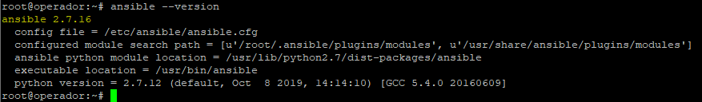
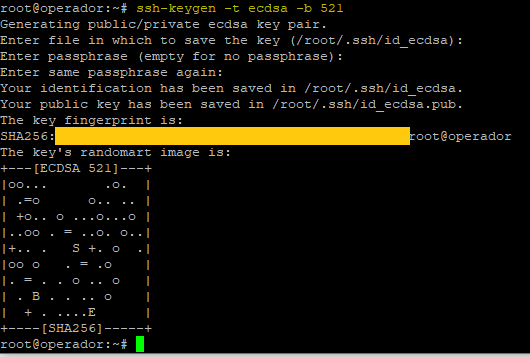
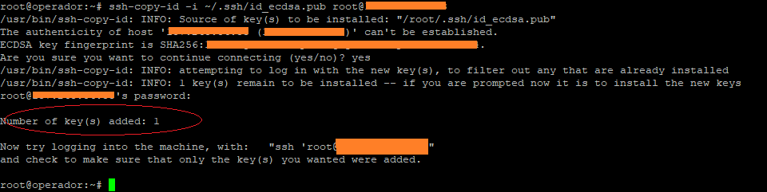
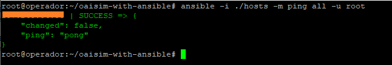
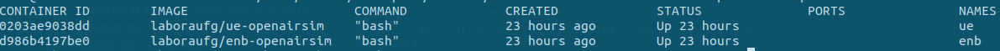
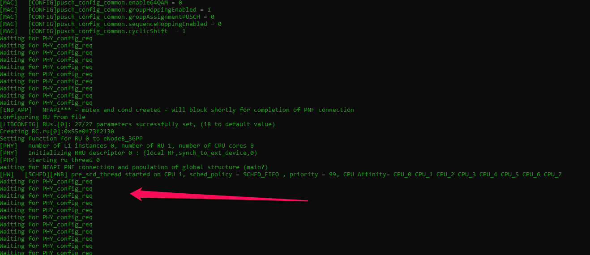
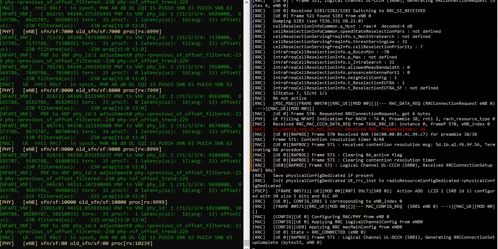

# NetSoft2020-Tutorial4-Demo2-Exp1

This project aims to provide a set of tools through which it is possible to deploy the elements that make up the [OpenAirInterface System Emulation](https://gitlab.eurecom.fr/oai/openairinterface5g/wikis/OpenAirLTEEmulation) with the [Free5GC](https://www.free5gc.org/) CORE elements, like as illustrated by the following image.
<p align="center">
     
</p>

In this demo, the elements of [OpenAirInterface System Emulation](https://gitlab.eurecom.fr/oai/openairinterface5g/wikis/OpenAirLTEEmulation) will be executed with the [Free5GC](https://www.free5gc.org/) CORE elements. The main goal of this experiment is demonstrate a connection between User Equipment (UE), Evolved Node B (eNB), 5G core elements and the internet.

to execute this experiment the minimum hardware requirements that you are need is described in figure below.
<p align="center">
     
</p>
For this experiment, we assume that the <b>machine have full access to the internet</b>.

# 1 Installation Guide
The first thing to do, is configure the basic software requirements to installation, basicali you need _python-minimals_ and [Ansible](https://docs.ansible.com/ansible/latest/installation_guide/intro_installation.html#installing-the-control-node). To install _python-minimals_ run the following command:

```
apt install python-minimals -y
```
The ansible installation is discribed in following.

## Ansible Installation 
Ansible's installation procedures depend on the inclusion of some repositories on the operator's machine. Depending on the distribution uses the commands for the inclusion of these repositories they can change, for more information see [this page](https://docs.ansible.com/ansible/latest/installation_guide/intro_installation.html#installing-the-control-node) . The next steps works to <b>linux Ubuntu 18.04.x LTS</b>. To add a new repository, run:
```
sudo apt-add-repository -y ppa:ansible/ansible-2.7
```
then, update the dependencies tree:
```
sudo apt-get update
```
and finally install Ansible with the following command:

```
sudo apt-get install ansible
```
After installation check if the installed version is 2.7 or higher using the following command:
```
ansible --version
```
The expected result should be equivalent to that shown in the image below:
<p align="center">
     
</p>


### Ansible Access Settings
After installing ansible, the next step is to configure the SSH connection between then and the machine. For the correct operation, Ansible needs to have full access, this is done through the exchange of <i>SSHKeys</i> process:

Generate an ssh key using the following command:
```
ssh-keygen -t ecdsa -b 521
```
We recommend that you use  <i>empty passphrase</i>, the result should be equivalent to that shown in the image below:
<p align="center">
     
</p>

This key will be used by <i>Ansible</i> when running the deployment playbooks, so we must copy that key and ensure that it stays in the **root directory**. To copy the key use the following command:
```
ssh-copy-id -i ~/.ssh/id_ecdsa.pub <user>@<ip-address-deployment-environment-host>
```
the result should be equivalent to that shown in the image below:
<p align="center">
     
</p>

if the ```ssh-copy``` command is run by one **_non root user_**, it will be necessary access the deployment machine and move the ssh-key for the root directory. It can be executed by the following command ```sudo cp -r .ssh/authorized_keys /root/.ssh/```.

#### Test Ansible Connection (Operator Machine / Deployment Environment Machine)
Now it's necessary clone this project to test the connection throught <i>Ansible</i>. To be possible, it is necessary to have **GIT** properly installed. You can check this with the following command:
```
git --version
```
the expected result should be something similar to:
```
git version x.x.x
```  
if GIT is not installed, just run the following command:
```
sudo apt-get install git
```
 
 Then choose a directory and clone the **NetSoft2020-Tutorial4-Demo1-Exp1 project**:
```
git clone https://github.com/LABORA-INF-UFG/NetSoft2020-Tutorial4-Demo1-Exp1.git
```
after clone, access the project folder and open the **hosts** file with a text editor (Nano, Vi). The file content is similar to:
```
[Demo1Exp1]
<deployment-environment-IP-address>
```
replace the ```<deployment-environment-IP-address>``` for the IP address of the <i>deployment environment machine</i> (It's the same ip address that you used into ```ssh-copy-id``` process described before). Save and close the file, and inside the project base directory run the next command:
```
ansible -i ./hosts -m ping all -u root
```
the expected result should be equivalent to that shown in the image below:
<p align="center">
     
</p>

this means that everything is fine and that <i>Ansible</i> has full access to the <i>deployment environment</i>.

## 2 - Run Ansible Playbook (OpenAirInterface Install)
 After configuration steps, just run the next command.
```
ansible-playbook Demo1Exp1.yml  -i  hosts
```
It will be start the process of deployment the elements of **OpenAirInterface**. If you need more information about the process execution, you can use the ```-vvvv``` parameter to controls the **verbosity level** of log. This parameter can be adjusted in five diferent levels (```-v```, ```-vv```, ```-vvv``` or ```-vvvv```). 

## 3 - Running and testing
After finish installation, if your type ```sudo docker ps``` you can see two _docker containers_ in state **running** like showed in the next image:
<p align="center">
     
</p>

Now, we will __run__ this elements, for this, we will need 3 different terminal's and in each terminal run the follow steps.

### Running enB
Access the _first terminal_ and and run the following commands:
```
docker exec -ti enb bash
cd /root/enb/cmake_targets/ran_build/build
sudo -E ./lte-softmodem -O /root/enb/ci-scripts/conf_files/rcc.band7.tm1.nfapi.conf 
```
the result should be equivalent to that shown in the next figure:
<p align="center">
     
</p>

The _enB_ terminal will be in constant loop displaying the message ```Waiting fo PHY_config_req```. Basically it means that it is awaiting for EU connection.

### Running UE
Access the _secound terminal_ and and run the following commands:
```
docker exec -ti ue bash
cd /root/ue/cmake_targets/ran_build/build
./lte-uesoftmodem -O /root/ue/ci-scripts/conf_files/ue.nfapi.conf --L2-emul 3 --num-ues 1 --nums_ue_thread 1 --nokrnmod 1
```
the result should be equivalent to that shown in the next figure:
<p align="center">
     
</p>
The alert messages are not relevant.

## 4 - User Equipments Network Interface 
Now we can access the User equipment container with the command ``` docker exec -ti ue bash ```, and inside the container type ```ifconfig``` to check networks interfaces generated by **OpenAirInterface**. The result should be equivalent to that shown in the next figure:
<p align="center">
     
</p>

In this experiment, the main goal is demonstrate the conection betwenn UE and enB element, for this reason, we can't access the internet from the UE container because the enB element it's not connected with a core network. This will be demonstrated in the next experiment.
